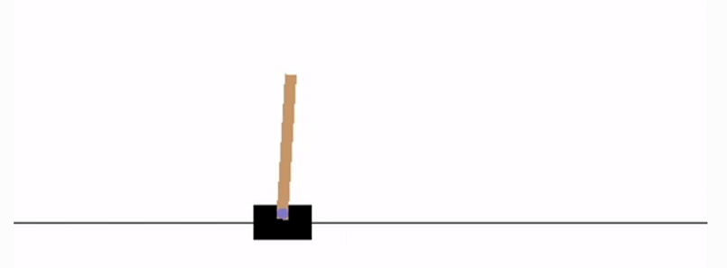

# DQN to play Cartpole game with pytorch

DQN to play Cartpole game with pytorch

## Introduction

Humans excel at solving a wide variety of challenging problems, from low-level motor control through to high-level cognitive tasks. 
Like a human, our agents learn for themselves to achieve successful strategies that lead to the greatest long-term rewards. This paradigm of 
learning by trial-and-error, solely from rewards or punishments, is known as reinforcement learning (RL). Also like a human, our agents 
construct and learn their own knowledge directly from raw inputs, such as vision, without any hand-engineered features or domain heuristics. 
This is achieved by deep learning of neural networks.
The agents must continually make value judgements so as to select good actions over bad. This knowledge is represented by a Q-network that 
estimates the total reward that an agent can expect to receive after taking a particular action. The key idea was to use deep neural networks 
to represent the Q-network, and to train this Q-network to predict total reward. Previous attempts to combine RL with neural networks had 
largely failed due to unstable learning. To address these instabilities, our Deep Q-Networks (DQN) algorithm stores all of the agent's experiences
 and then randomly samples and replays these experiences to provide diverse and decorrelated training data.  
Reinforcement learning:  
  
In this post, I implement a DQN to Cartpole game:  
  

## Methodology

1. Define a Actor network and a Critic Network
2. Get data (state, next_state, reward, done signals) from gym
3. Play Cartpole game and calculate rewards for each step at the end of one game, train the two networks
4. Save the model

## References:
https://morvanzhou.github.io/tutorials/machine-learning/reinforcement-learning/5-2-policy-gradient-softmax2/  
https://github.com/higgsfield/RL-Adventure-2/blob/master/1.actor-critic.ipynb  
https://morvanzhou.github.io/tutorials/machine-learning/reinforcement-learning/5-2-policy-gradient-softmax2/  
https://arxiv.org/pdf/1509.02971.pdf  
